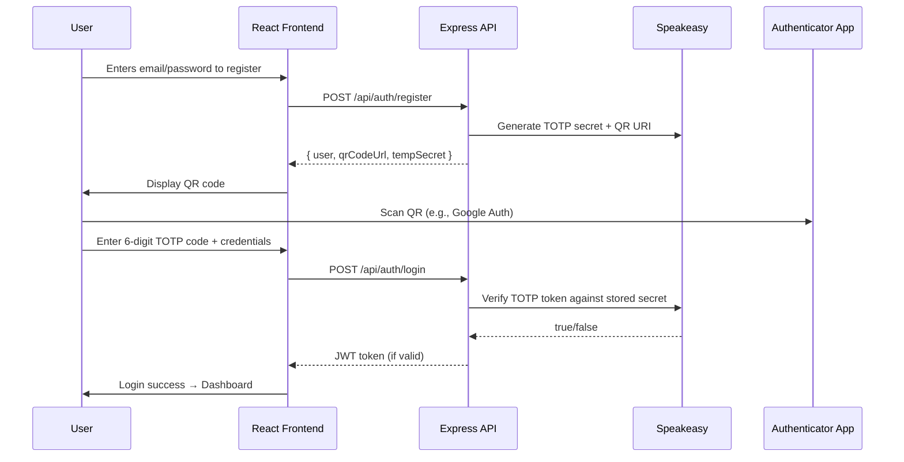

# 🔐 React + Node.js Multi-Factor Authentication (MFA) System
---

## 🌟 Overview

This project implements a **working TOTP-based MFA flow** (like Google Authenticator) with:

- ✅ **Frontend**: React (Vite), Tailwind CSS
- ✅ **Backend**: Node.js + Express
- ✅ **TOTP**: `speakeasy` for secret generation + token verification
- ✅ **QR Code**: `qrcode` for provisioning URI → QR image
- ✅ **Storage**: In-memory user store (simulated DB)
- ✅ **Auth Flow**: Register → Scan QR → Login with 6-digit code
- ✅ **Session**: Simple JWT token on successful MFA login

> 💡 Ideal for demonstrating:  
> - Full-stack integration  
> - Security protocol implementation (TOTP)  
> - Clean separation of concerns  
> - API design + state management

---

## 📊 System Flow (Mermaid)



---

## 🧩 Tech Stack (Implemented Only)

| Layer        | Technology             |
|--------------|------------------------|
| **Frontend** | React, Vite, Tailwind CSS, `qrcode.react` |
| **Backend**  | Node.js, Express, `speakeasy`, `jsonwebtoken`, `bcryptjs` |
| **State**    | In-memory `users` array (no DB) |
| **Tools**    | `concurrently`, `nodemon`, `cors`, `dotenv` |
| **No extras**| No Docker, Redis, PostgreSQL, Kubernetes, CI/CD, or testing frameworks |

---

## 🛠️ Setup & Installation

### Prerequisites

- Node.js ≥ v16
- npm

### Clone & Install

```bash
git clone https://github.com/bungydotgit/react-node-mfa.git
cd react-node-mfa
```

### Install Dependencies

```bash
# Install server
cd server
npm install

# Install client
cd ../client
npm install
```

### Set Environment Variables

In `/server`, create `.env`:

```env
PORT=5000
JWT_SECRET=your_32_char_or_longer_secret_here
```

> ⚠️ Keep `JWT_SECRET` safe — used to sign session tokens.

### Run the App

From the **root** directory:

```bash
npm run dev
```

> Uses `concurrently` to run both client (port 5173) and server (port 5000).

✅ Open [http://localhost:5173](http://localhost:5173) to begin.

---

## 🔄 How It Works

### 1. Registration

- User enters email + password.
- Server:
  - Hashes password with `bcryptjs`
  - Generates TOTP secret via `speakeasy.generateSecret()`
  - Stores user + secret temporarily in memory
  - Returns `otpauth://` URI → converted to QR code on frontend
- Frontend displays QR code for user to scan.

### 2. Login

- User enters email, password, and current 6-digit TOTP code.
- Server:
  - Finds user
  - Verifies password
  - Validates TOTP token against stored secret
  - If valid → issues JWT
- Frontend stores JWT and redirects to protected view.

### 3. “Protected” Dashboard

- Simple page showing “You’re logged in!” — no actual protected API calls yet.
- JWT is stored in memory (not persisted — refresh loses login).

---

## 🧱 Project Structure (Relevant Only)

```
react-node-mfa/
├── client/
│   ├── src/
│   │   ├── components/
│   │   │   ├── AuthForm.tsx       # Handles register/login UI
│   │   │   └── QRCodeDisplay.tsx  # Renders QR using qrcode.react
│   │   ├── pages/
│   │   │   ├── AuthPage.tsx       # Main auth view
│   │   │   └── Dashboard.tsx      # Post-login (simple)
│   │   ├── services/
│   │   │   └── authService.ts     # API calls to /api/auth/*
│   │   └── App.tsx
│   └── ...
└── server/
    ├── src/
    │   ├── controllers/
    │   │   └── authController.ts  # Handles register/login logic
    │   ├── routes/
    │   │   └── authRoutes.ts      # Mounts POST /register, /login
    │   ├── utils/
    │   │   └── generateQR.ts      # Generates otpauth:// URI + QR data URL
    │   └── server.ts              # Express app + middleware (CORS, JSON)
    └── .env
```

---

## 🔒 Security Notes (Implemented)

- ✅ Passwords hashed with `bcryptjs`
- ✅ TOTP secret generated server-side, never stored permanently
- ✅ JWT signed with secret (expires in 1h — hardcoded)
- ✅ CORS restricted to `localhost:5173`
- ⚠️ **No rate limiting** (not implemented)
- ⚠️ **No input validation/sanitization** beyond basic existence checks
- ⚠️ **Secrets stored in memory** — restart = data loss


## 📈 Possible Next Steps (Great Interview Talking Points!)

- ➕ Add input validation (Zod / Joi)
- ➕ Add rate limiting (express-rate-limit)
- ➕ Persist users + secrets (SQLite / PostgreSQL)
- ➕ Add token refresh flow
- ➕ Add logout / token invalidation
- ➕ Write unit tests for auth logic
- ➕ Add recovery codes

---
